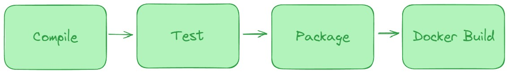

# Spring Petclinic via Jenkins Pipeline

## Building the Docker Image

To successfully build the Docker image, ensure that the Docker daemon is installed and running in the environment where Jenkins is executing the pipeline. In this example, the pipeline is executed on the localhost where Jenkins and the Docker daemon are installed.

You may also need to add the Jenkins user to the docker group for the build command to execute successfully. You can do that by executing the following command (on the Jenkins host in this example) and restarting Jenkins:

```sudo usermod -aG docker Jenkins```

## Running the Container

To run the container built from this Jenkins pipeline, use the following command:

```docker run -d -p 8081:8080 agerlitz/petclinic:latest```

In this example, bothe the Docker daemon and Jenkins are running on the local machine. As a result, applications and running containers are reachable on localhost. To access the application, open a web browser and navigate to localhost:8081.

For more detailed information about the Spring Petclinic application see the following git repository:
<https://github.com/ADuckPond/spring-petclinic>

## The Jenkins Pipeline Explained

This Jenkins pipeline has four main steps: Compile, Test, Package, and Docker Build.



    - Compile: Executes mvn compile against the code in the spring-petclinic repository.
    - Test: Executes mvn test executes the tests included in the spring-petclinic project.
    - Package: Packages the application into an executable jar for use in the next step.
    - Docker Build: uses the Dockerfile stored in the spring-petclinic repo to build an executable container image.

### More Information on the Dockerfile

The Dockerfile used in the Docker Build step is also included in this repository. It consist of four commands:
    - FROM: Specifies the base image to start from (in this case openjdk:23-ea-jdk-oracle) 
    - ADD: Brings the contents of the target directory into the container. This is where the executable jar is after the Package step.
    - WORKDIR: Specifies the directory to switch to and work from (in this case we switch to the location of the files we brought over via ADD).
    - CMD: Specifies the command to execute when running the container. This command executes the jar file and runs our application.